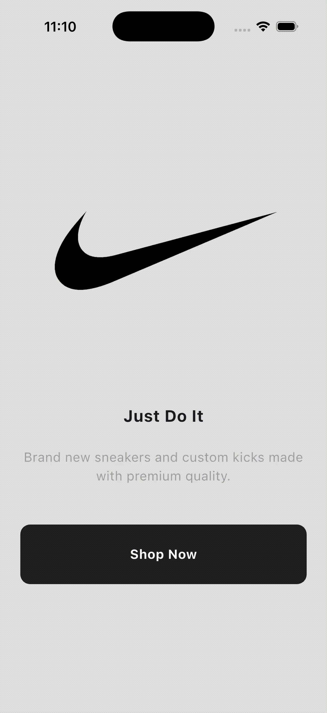
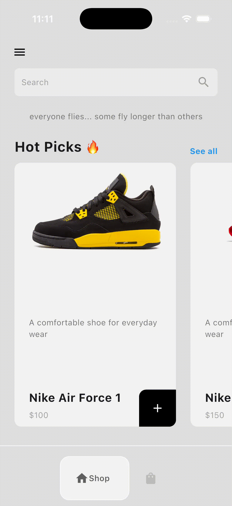
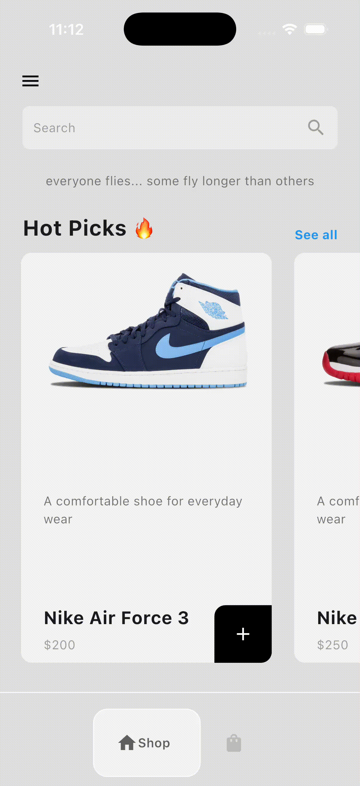
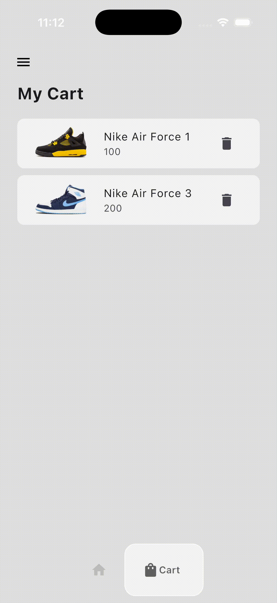

# Flutter Sneakertute

Flutter로 개발된 스니커즈 쇼핑 앱입니다. Provider를 사용한 상태 관리와 직관적인 UI/UX를 제공하며, 스니커즈 브라우징, 장바구니 관리 기능을 제공합니다.

## 주요 기능

### 🎯 Intro 화면에서 Main 화면으로 이동
앱 시작 시 Nike 브랜드 소개 화면을 보여주며, "Shop Now" 버튼을 통해 메인 쇼핑 화면으로 이동할 수 있습니다.



### 📱 Menu Drawer 열기
좌측 상단 메뉴 아이콘을 통해 사이드 메뉴를 열 수 있습니다. Home, About, Logout 등의 메뉴를 제공합니다.



### 🔥 Hot Picks 카드 목록 횡스크롤
인기 스니커즈를 카드 형태로 표시하며, 좌우 스크롤을 통해 다양한 제품을 탐색할 수 있습니다.


### 🧭 하단 독바 페이지 이동
하단 네비게이션 바를 통해 Shop 페이지와 Cart 페이지를 쉽게 전환할 수 있습니다.



### 🛒 장바구니에서 아이템 제거
장바구니에 담긴 스니커즈를 삭제 버튼을 통해 제거할 수 있습니다.



## 기술 스택

- **Flutter**: 크로스 플랫폼 모바일 앱 개발 프레임워크
- **Provider**: 상태 관리 패키지
- **google_nav_bar**: 하단 네비게이션 바 구현

## 프로젝트 구조

```
lib/
├── main.dart                    # 앱 진입점 및 Provider 설정
├── models/
│   ├── shoe.dart               # Shoe 모델
│   └── cart.dart               # Cart 상태 관리 모델
├── pages/
│   ├── intro_page.dart         # 인트로 화면
│   ├── home_page.dart          # 메인 홈 화면 (Drawer, Bottom Nav 포함)
│   ├── shop_page.dart          # 쇼핑 페이지
│   └── cart_page.dart          # 장바구니 페이지
└── components/
    ├── bottom_nav_bar.dart      # 하단 네비게이션 바
    ├── shoe_tile.dart          # 스니커즈 카드 위젯
    └── cart_item.dart          # 장바구니 아이템 위젯
```

## 시작하기

### 필수 요구사항

- Flutter SDK (3.10.1 이상)
- Dart SDK
- Android Studio / Xcode (모바일 개발용)

### 설치 및 실행

1. 저장소 클론

```bash
git clone <repository-url>
cd flutter_sneakertute
```

2. 의존성 설치

```bash
flutter pub get
```

3. 앱 실행

```bash
flutter run
```

## 주요 의존성

- `provider: ^6.1.2` - 상태 관리
- `google_nav_bar: ^5.0.7` - 하단 네비게이션 바

## 기능 상세

### 상태 관리
- Provider 패턴을 사용하여 Cart 상태를 전역으로 관리합니다
- 장바구니 추가/삭제 시 실시간으로 UI가 업데이트됩니다

### UI/UX
- 깔끔한 그레이 컬러 테마
- 직관적인 카드 기반 제품 표시
- 횡스크롤을 통한 제품 탐색
- 사이드 메뉴와 하단 네비게이션을 통한 쉬운 화면 전환

### 쇼핑 기능
- Hot Picks 섹션에서 인기 스니커즈 확인
- 제품 카드 탭으로 장바구니에 추가
- 장바구니에서 제품 확인 및 삭제

## 라이선스

이 프로젝트는 개인 학습 및 포트폴리오 목적으로 제작되었습니다.
